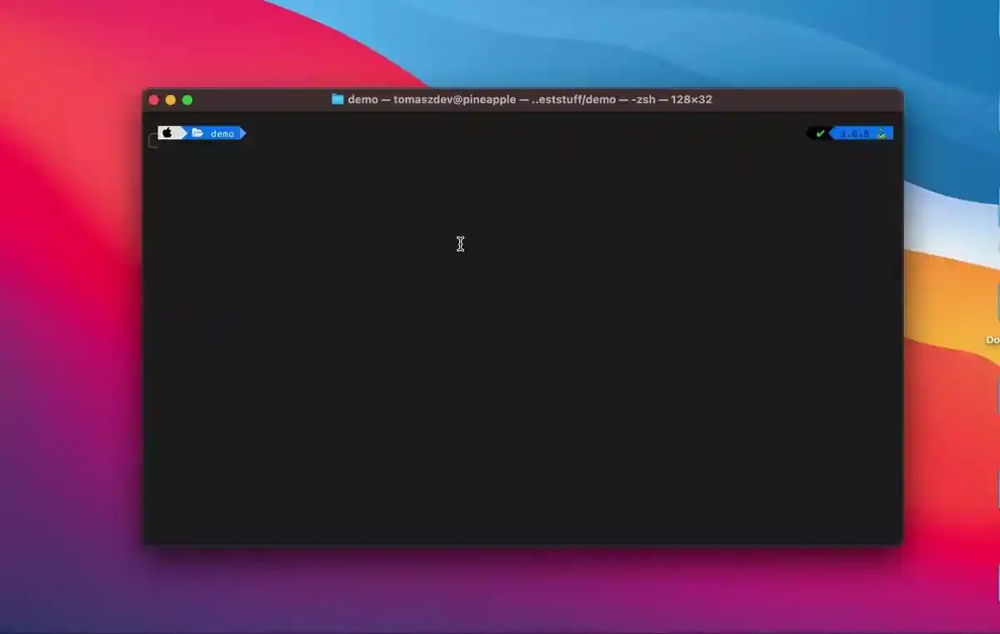

Python-Datastructures is a Python library containing implementations of various data structures written purely in Python. Useful when preparing for interviews or building school projects. Allow the user to focus on developing your algorithms and not worry about finding python implementations of classic data structures.

## Installation

Use the package manager [pip](https://pip.pypa.io/en/stable/) to install python-datastructures.

```bash
pip install python-datastructures
```

## Usage

Sample usage of the library. Import any datastructure from the list of supported datastructures.

- Stack
- Queue
- DeQueue
- SinglyLinkedList
- DoublyLinkedList
- CircularList
- MaxHeap
- MinHeap
- Trie



```python
from python_datastructures import MinHeap

arr = [2,3,18,29,7,82,1,9]
heap = MinHeap(arr)
print(heap.peek()) # returns 1
```

## Documentation

Explore the Different data structures and methods associated with them.
Documentation below describes the various methods associated with each data structure as well as a short description on what it does.

[Read the docs](https://tutomasz.github.io/Python-Datastructures/docs/python_datastructures/index.html)

## Development

To set up dev environment and work on the package clone the repository then run.

```makefile
make setup
```

Other usefull development commands include:

```makefile
make test               // run tests
make lint               // code formatting
make build              // build package localy
make install-build      // install local package globally
make uninstall-build    // uninstall local package gloablly
```

## Contributing

Pull requests are welcome. For major changes, please open an issue first to discuss what you would like to change.

Please make sure to update tests as appropriate.

## License

[MIT](https://choosealicense.com/licenses/mit/)
